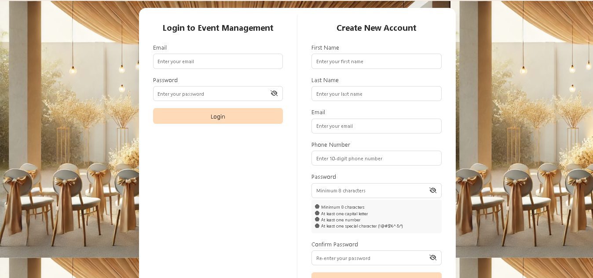
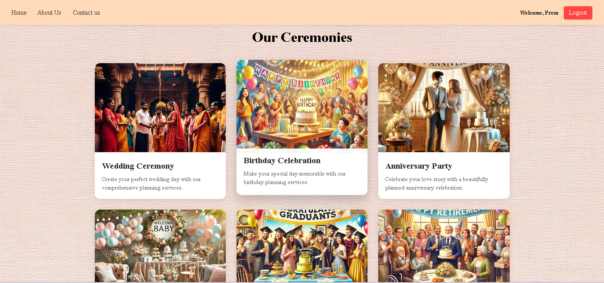
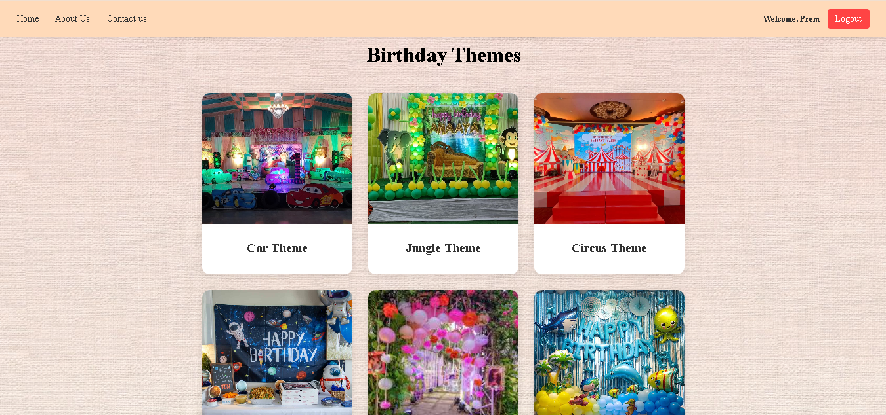
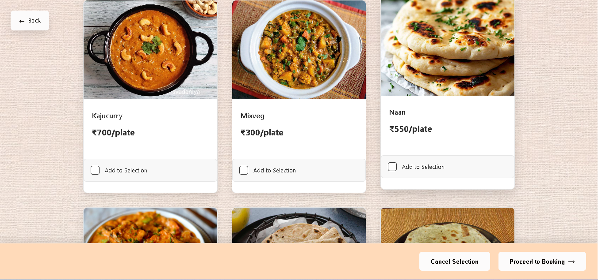
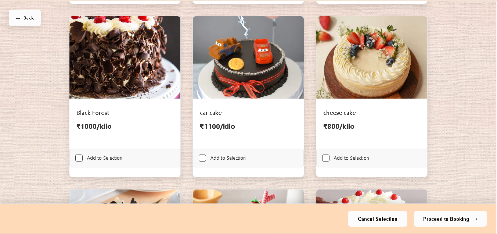
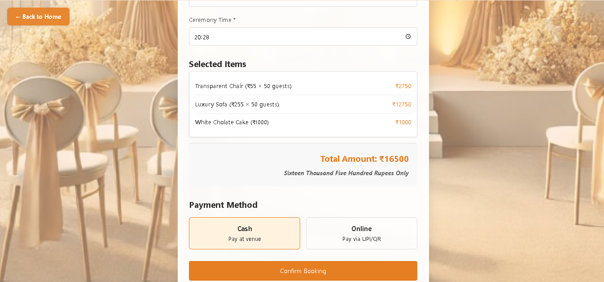
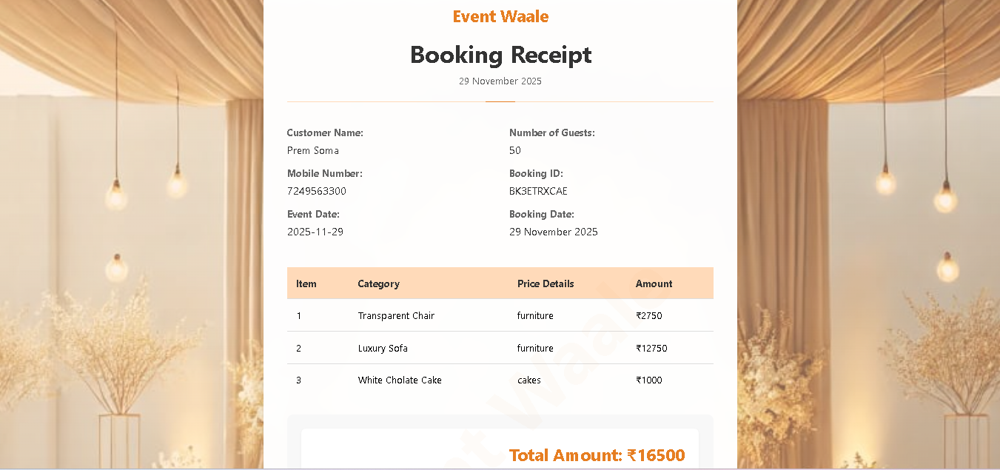
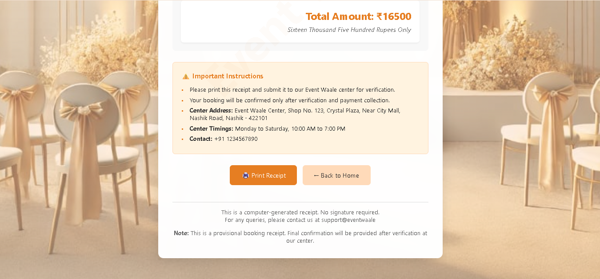

EventWale – Online Event Management Platform

EventWale is a web application that allows users to plan and manage events online. Users can browse and select services across various categories such as decoration, stage, lights, flowers, food, and more. After making selections, they can submit approval requests directly to the offline store via the platform.

Features:

Browse and select services for events
Multiple categories: Decoration, Stage, Lights, Flowers, Food, etc.
Submit online approval to offline stores
User-friendly interface for easy event planning

